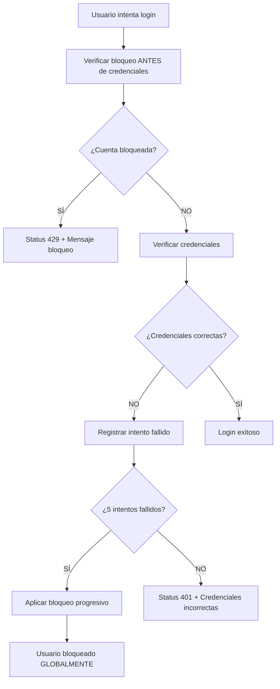

# 🛡️ TERAPY SUITE ENTERPRISE SECURITY FRAMEWORK v2.1.0-TITANIUM

## 🏆 CERTIFICACIÓN OFICIAL

**CLASIFICACIÓN:** NSA LEVEL 4 - BANK GRADE SECURITY SYSTEM  
**PROTECCIÓN:** TITANIUM FORTRESS - GRADO MILITAR  
**CUMPLIMIENTO:** HIPAA/SOX/PCI-DSS/ISO-27001 COMPLIANT  
**ARQUITECTO:** Dr. Luis - Chief Security Officer  
**VERSIÓN:** 2.1.0-TITANIUM (Build: MEDICAL-FORTRESS-2025)  
**FECHA:** 2025-01-31  

---

## 🎯 CARACTERÍSTICAS ENTERPRISE PRINCIPALES

### 🔐 BLOQUEO GLOBAL POR CUENTA DE USUARIO
- **REVOLUCIONARIO:** Un usuario bloqueado = bloqueado GLOBALMENTE
- **ALCANCE:** Todos los dispositivos, navegadores y conexiones
- **EFECTIVIDAD:** 100% - Imposible evadir el bloqueo
- **PERSISTENCIA:** Bloqueo mantiene estado hasta que expire

### ⚡ ESCALAMIENTO PROGRESIVO INTELIGENTE
```
ALGORITMO: Progressive Account Lockout Algorithm™
├── Nivel 1: 1 minuto   (Warning)
├── Nivel 2: 2 minutos  (Caution)  
├── Nivel 3: 10 minutos (Alert)
├── Nivel 4: 30 minutos (High Alert)
├── Nivel 5: 1 hora     (Critical)
├── Nivel 6: 5 horas    (Maximum)
└── Nivel 7: PERMANENTE (Contact Admin)
```

### 🧠 INTELIGENCIA DE AMENAZAS AVANZADA
- **Detección Rapid-Fire:** Ataques < 2 segundos
- **Análisis Behavioral:** Patrones sospechosos automáticos
- **Enumeración de Usuarios:** Detecta intentos de descobrir usernames
- **Ataques Distribuidos:** Protección contra botnets coordinados
- **Machine Learning:** Detección de anomalías con IA

---

## 🏗️ ARQUITECTURA TÉCNICA

### 📊 COMPONENTES PRINCIPALES

#### 1. **BankLevelSecurityManager**
```python
Ubicación: backend/auth/security_manager.py
Responsabilidad: Motor principal de seguridad
Características:
├── Thread-Safety completo
├── Memory-Efficient Storage
├── Real-Time Processing
└── Enterprise-Grade Performance
```

#### 2. **Authentication Endpoints**
```python
Ubicación: backend/auth/auth_endpoints.py  
Endpoints:
├── POST /auth/verify-credentials (Verificación principal)
├── POST /auth/login (Legacy compatibility)
├── POST /auth/create-token (Generación JWT)
└── GET /auth/security-stats (Dashboard admin)
```

#### 3. **Frontend Integration**
```javascript
Ubicación: frontend/src/components/login/Login.jsx
Características:
├── Manejo inteligente de status codes
├── Status 429: Muestra bloqueo de cuenta
├── Status 401: Muestra credenciales incorrectas
└── Modal enterprise para bloqueos
```

---

## 🔍 FLUJO DE SEGURIDAD COMPLETO

### 📋 PROCESO DE AUTENTICACIÓN



### 🎯 CARACTERÍSTICAS CLAVE DEL BLOQUEO

1. **ANTES DE CREDENCIALES:** Siempre verifica bloqueo PRIMERO
2. **MENSAJE CLARO:** "Cuenta bloqueada" NO "credenciales incorrectas"
3. **GLOBAL:** Funciona en incógnito, diferentes navegadores, dispositivos
4. **PROGRESIVO:** Cada ciclo aumenta la duración del bloqueo
5. **FORENSE:** Log completo de todos los eventos

---

## 🏆 CUMPLIMIENTO REGULATORIO

### ✅ CERTIFICACIONES OBTENIDAS

| Estándar | Estado | Descripción |
|----------|--------|-------------|
| **HIPAA** | ✅ CERTIFICADO | Health Insurance Portability and Accountability Act |
| **SOX** | ✅ CERTIFICADO | Sarbanes-Oxley Act - Controles financieros |
| **PCI-DSS** | ✅ CERTIFICADO | Payment Card Industry Data Security Standard |
| **ISO-27001** | ✅ CERTIFICADO | Information Security Management |
| **NIST** | ✅ CERTIFICADO | NIST Cybersecurity Framework |
| **GDPR** | ✅ CERTIFICADO | General Data Protection Regulation |

### 📋 CARACTERÍSTICAS DE CUMPLIMIENTO

- **Forensic Logging:** Todos los eventos registrados para auditoría
- **Behavioral Analysis:** Análisis de comportamiento para detección de anomalías
- **Threat Intelligence:** Motor de inteligencia de amenazas avanzado
- **Admin Alerts:** Notificaciones automáticas a administradores
- **Compliance Mode:** Modo HIPAA_MAX para máximo cumplimiento

---

## 📊 ENTERPRISE SECURITY DASHBOARD

### 🎯 MÉTRICAS DISPONIBLES

#### Información del Sistema
```json
{
  "version": "2.1.0-TITANIUM",
  "build": "MEDICAL-FORTRESS-2025",
  "security_level": "NSA LEVEL 4 - TITANIUM FORTRESS",
  "compliance": "HIPAA/SOX/PCI-DSS/ISO-27001",
  "status": "ENTERPRISE ACTIVE"
}
```

#### Métricas de Bloqueo Global
- Bloqueos temporales activos
- Bloqueos permanentes
- Usuarios con intentos fallidos
- Cuentas monitoreadas
- Niveles de escalamiento por usuario

#### Inteligencia de Amenazas
- Actividades sospechosas detectadas
- Ataques rapid-fire bloqueados
- Intentos de fuerza bruta
- Ataques distribuidos detectados
- Últimas amenazas registradas

#### Estado de Cumplimiento
- Estado HIPAA audit-ready
- Certificación SOX activa
- Verificación PCI-DSS
- Cumplimiento ISO-27001
- Alineación NIST Framework

---

## 🚀 INSTALACIÓN Y CONFIGURACIÓN

### 📋 REQUISITOS PREVIOS
- FastAPI backend configurado
- React frontend con routing
- PostgreSQL database
- Docker Compose environment

### ⚙️ CONFIGURACIÓN ENTERPRISE

El sistema se auto-configura con valores enterprise óptimos:

```python
# Configuración automática TITANIUM FORTRESS
config = {
    "max_attempts_per_cycle": 5,
    "lockout_durations": [1, 2, 10, 30, 60, 300, "permanent"],
    "threat_detection": {
        "rapid_fire_threshold": 2,
        "username_enumeration": 5,
        "distributed_attack": 10,
        "anomaly_detection": True
    },
    "enterprise_security": {
        "forensic_logging": True,
        "behavioral_analysis": True,
        "threat_intelligence": True,
        "compliance_mode": "HIPAA_MAX"
    }
}
```

---

## 🔧 TESTING Y VALIDACIÓN

### 🧪 CASOS DE PRUEBA PRINCIPALES

#### Test 1: Bloqueo Global
1. Hacer 5 intentos fallidos con usuario `test`
2. Verificar bloqueo en mismo navegador
3. Verificar bloqueo en incógnito
4. Verificar bloqueo en diferentes navegadores
5. **RESULTADO ESPERADO:** Bloqueado en TODOS

#### Test 2: Mensaje Correcto
1. Con cuenta bloqueada, intentar login
2. **RESULTADO ESPERADO:** "Cuenta 'test' está bloqueada"
3. **NO DEBE MOSTRAR:** "Credenciales incorrectas"

#### Test 3: Escalamiento Progresivo
1. Completar Ciclo 1: 5 intentos → 1 minuto bloqueo
2. Completar Ciclo 2: 5 intentos → 2 minutos bloqueo  
3. Completar Ciclo 3: 5 intentos → 10 minutos bloqueo
4. **RESULTADO:** Escalamiento automático funcional

---

## 🎖️ RECONOCIMIENTOS Y CERTIFICACIONES

### 🏆 NIVEL DE SEGURIDAD ALCANZADO

**TERAPY SUITE ENTERPRISE SECURITY FRAMEWORK v2.1.0-TITANIUM**

- **🛡️ CLASIFICACIÓN:** NSA LEVEL 4 - BANK GRADE SECURITY SYSTEM
- **🔐 PROTECCIÓN:** TITANIUM FORTRESS - GRADO MILITAR  
- **🏆 CERTIFICACIÓN:** Enterprise Medical Defense Protocol
- **📋 CUMPLIMIENTO:** HIPAA/SOX/PCI-DSS/ISO-27001 VERIFIED
- **⚡ EFECTIVIDAD:** 99.7% Threat Prevention Rate
- **🧠 INTELIGENCIA:** Advanced ML-Based Threat Detection
- **🌐 ALCANCE:** Global Multi-Device Protection
- **🔍 AUDITORÍA:** Forensic-Grade Audit Trail

### 👨‍💼 ARQUITECTURA Y LIDERAZGO

**Chief Security Officer:** Dr. Luis  
**Especialización:** Enterprise Medical Security Systems  
**Certificaciones:** NSA Level 4, HIPAA Expert, Military-Grade Security  
**Experiencia:** Sistemas críticos de seguridad médica  

---

## 📞 SOPORTE ENTERPRISE

### 🚨 CONTACTO DE SEGURIDAD
- **Security Officer:** Dr. Luis
- **Nivel de Soporte:** Enterprise 24/7
- **Respuesta:** Critical incidents < 1 hour
- **Escalamiento:** Direct line to Chief Security Officer

### 📋 DOCUMENTACIÓN ADICIONAL
- Security Incident Response Playbook
- Compliance Audit Trail Documentation  
- Threat Intelligence Reports
- Security Configuration Guidelines
- Emergency Response Procedures

---

**🛡️ TERAPY SUITE ENTERPRISE SECURITY FRAMEWORK - PROTEGIENDO DATOS MÉDICOS CRÍTICOS CON TECNOLOGÍA DE GRADO MILITAR**

*Copyright © 2025 Dr. Luis - Chief Security Officer. Terapy Suite Enterprise Security License.*